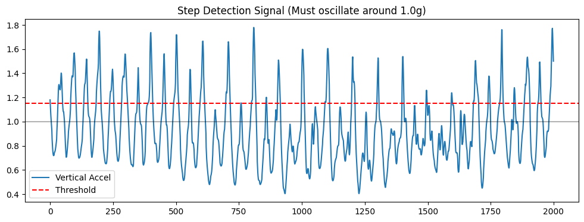
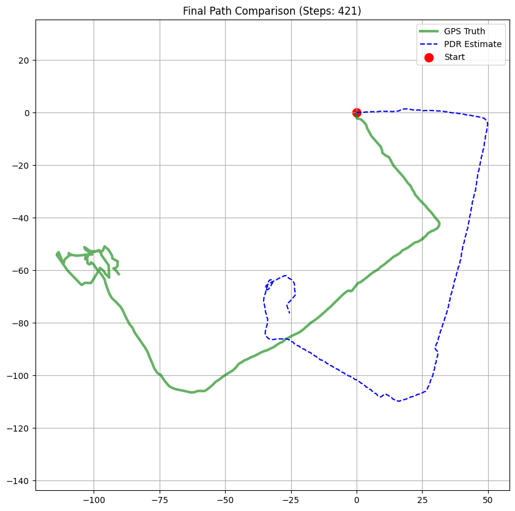

# Lokata
### /ˈlʊkætə/

## Project Goal
Building a GNSS tracker that still knows where it is when the GPS signal dies.

## The Solution
- Pedestrian Dead Reckoning (PDR): Uses the onboard 9-axis IMU to estimate position without GPS.
- Method: Fuses sensor data (Madgwick filter) for direction and counts steps for distance.
- Status: Work-in-progress hobby build. Expect some drift.

## Hardware
- LilyGO T-Beam Supreme (ESP32-S3)
- Onboard GNSS (u-blox)
- 9-Axis IMU (BMI270 + QMC6310)

accel drift. 

increased step scale, invert heading