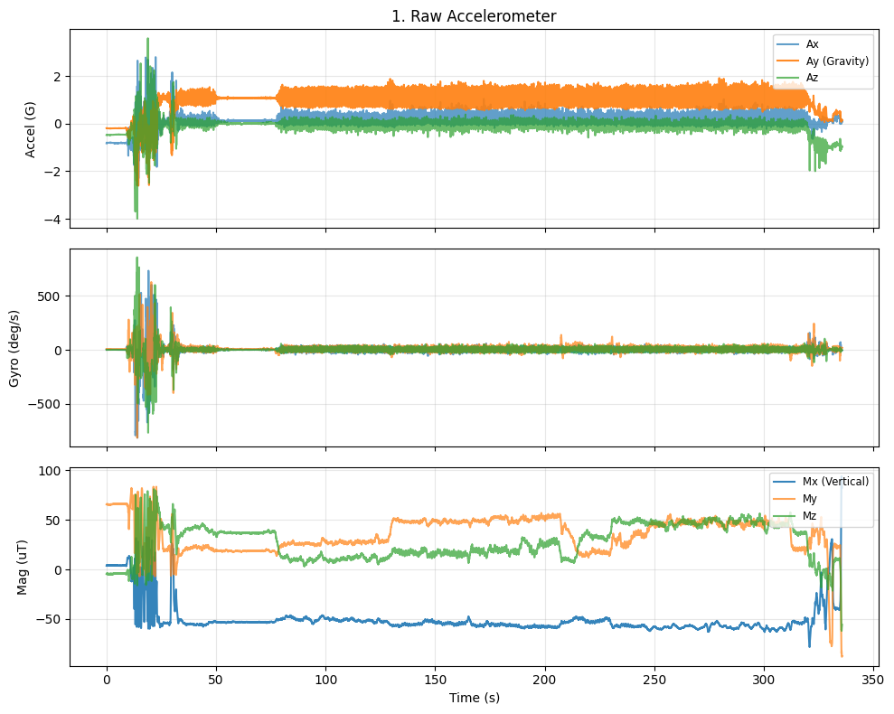
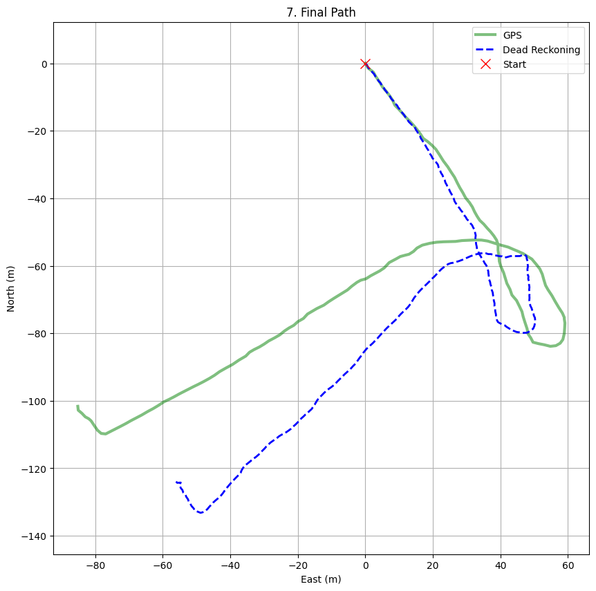

# Lokata
### /ˈlʊkætə/

## Project Goal
Building a GNSS tracker that still knows where it is when the GPS signal dies.

## The Solution
- Build Arduino project to send IMU + Magnetometer + GNSS data from T-Beam Supreme at highest rate possible via serial. **See src/main.cpp**
- Record data over serial to csv on computer. **See analysis/capture.py**
- Pedestrian Dead Reckoning (PDR): Uses the onboard 9-axis IMU to estimate position without GPS.
- Method: Fuses sensor data (Madgwick filter) for direction and counts steps for distance.
- Status: Work-in-progress hobby build. Expect some drift.

## Hardware
- LilyGO T-Beam Supreme (ESP32-S3)
- Onboard GNSS (u-blox)
- 9-Axis IMU (BMI270 + QMC6310)

## Current State

Raw data

Output

**See analysis/ahrs.ipynb for more detail**

## Next Steps
- Test on unseen walks.
- Move calculation onto ESP32. There will be obvious performance considerations like sampling rate, datatypes, streaming live data not rolling windows that can 'see into the future'.